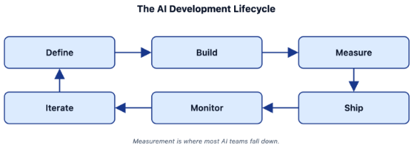

# Lecture 1: Why AI Agents Break in Production

> **Learning objective:** Understand why traditional software testing isn't enough for AI applications, why evaluation ("evals") is foundational to reliable AI engineering, and where Arize AX fits into the picture.

---

## 1. Why Shipping AI Is Different

In traditional software, you can usually reason about correctness from the code itself:

```python
assert add(2, 3) == 5
```

The expected output is known in advance, so a test either passes or fails.

AI systems don't work this way. Ask an app to *"explain why my database query is slow"* and there are many valid answers — different wording, structure, and detail, all potentially useful. There's no single "correct" string to assert against.

This gets harder with **agents**, which don't just generate text — they interpret a request, choose tools, call them, inspect results, and decide what to do next. Any one of those steps can go wrong while the final answer still *looks* fine:

```text
User Request → Agent → [wrong tool? bad retrieval? poor reasoning?] → Final Answer
```

A confident, well-written answer can still be built on a broken process underneath. That's why shipping an AI system takes a different discipline than getting a good demo.

---

## 2. The "Vibes" Problem

The most common trap in AI development is judging quality by eyeballing a handful of outputs and deciding *"this seems better."* This is **vibe-based evaluation**.

A typical scenario: a developer rewrites a prompt, tests it on 5–10 examples, likes what they see, and ships it. But the prompt now runs against thousands of real requests it was never checked against. It might improve coding questions while quietly making support responses too terse, increasing hallucinations elsewhere, or making every response longer and more expensive — and no one would know until users notice.

**The core problem:** manual inspection doesn't scale as a quality-control mechanism. Production AI needs measurable evidence, not impressions.

---

## 3. What You Can't Do Without Evals

An **eval** is a systematic, repeatable way of measuring whether an AI system behaves as expected. Without one, several everyday engineering tasks become guesswork:

**Detect regressions when you change a prompt.** A prompt change is a behavior change, just like a code change — it should be tested like one. *(Illustrative, not real data:)* if your old prompt scores 82% on an eval set and a revision scores 74%, you've caught a regression before it reaches users — not after.

**Compare prompt versions objectively.** Instead of "I think v3 sounds better," you get a number for each version against the same dataset. Evidence beats opinion.

**Know if a new model is actually better.** New foundation models ship every few months, and the newest one isn't automatically the best fit *for your application* — it might reason better but follow instructions worse, or be faster and cheaper but less accurate. You only know by testing it against your own eval set, not a generic benchmark.

**Run quality gates in CI.** Once evals are repeatable, they can block a bad change automatically:

```text
New prompt score < minimum threshold  →  reject the change
New prompt score ≥ minimum threshold  →  allow deployment
```

This turns "did I make it worse?" from a question you ask after shipping into a check you run before shipping.

---

## 4. This Isn't Theoretical

Without evals, switching models or prompts becomes a manual testing project — run the app, eyeball outputs, repeat for many scenarios, hope you covered the important cases. That can take weeks. With a reusable eval suite, the same comparison can often be done in hours, because you're rerunning a known dataset instead of re-inventing your test cases each time.

This pattern shows up across the industry — products like **Descript, Bolt, and Claude Code** have followed the same arc: start with prompt-and-vibes iteration, then move to systematic evaluation as the product matures and the cost of an unnoticed regression grows.

---

## 5. Shipping Is Not the Finish Line

Production traffic will surface situations your test set never anticipated — unexpected phrasing, edge cases, unusual tool-use combinations. That's not a failure of your evals; it's a normal part of the lifecycle: shipping moves a system from controlled evaluation into real-world use, and what you learn there feeds back into the next round of development.



Measurement is the stage most AI teams skip or shortcut — which is exactly the gap evals are meant to fill. The loop in practice looks like:

```text
Ship → real users hit new cases → failures surface →
add them to the eval dataset → fix → re-evaluate → ship again
```

---

## 6. Where Arize AX Fits

Arize AX is built around this lifecycle through three core capabilities:

- **Observe** — see what your application is actually doing (which tools it called, what it retrieved, what it generated) instead of just the final answer.
- **Evaluate** — grade that behavior, both **offline** (against a known dataset, before deployment) and **online** (against live production traffic, after deployment).
- **Improve** — turn what you learn into action: build better datasets, run prompt/model experiments, and confirm the fix actually helped before shipping it.

```text
        AI Application
              |
   +----------+----------+
   |          |           |
Observe   Evaluate    Improve
   |          |           |
   +----------+----------+
              |
       Better AI System
```

Evals are what connect these three — they're the signal that tells you whether an "improvement" actually improved anything.

---

## Key Takeaways

1. **AI systems aren't deterministic** — a small prompt, model, or retrieval change can shift behavior unpredictably.
2. **"Looks good" isn't a strategy** — a handful of manually-checked examples isn't enough evidence for a production decision.
3. **Evals make change measurable** — for prompts, models, and any other system change.
4. **Evals catch regressions before users do**, and can gate CI/CD deployments.
5. **Production is part of the learning loop** — real traffic finds failure modes your initial dataset didn't.
6. **Evals are the connective tissue** between development, experimentation, and production learning — which is exactly what Arize AX is built to support.

---

## Check Your Understanding

Before moving to Lecture 2, you should be able to answer:

1. Why is shipping an AI agent different from shipping deterministic software?
2. What is the "vibes" problem, and why doesn't it scale?
3. Why can changing a prompt cause a production regression?
4. Why isn't the newest model automatically the best model for your application?
5. What's the difference between offline and online evaluation?
6. What role do Observe, Evaluate, and Improve each play in Arize AX?
7. How can evals act as a quality gate in CI/CD?

---

## Summary

Production AI engineering is fundamentally a **measurement problem**. It's easy to build something that produces a few impressive examples; it's much harder to prove the system performs consistently, catch when it gets worse, and improve it without breaking something else. Evals are what turn AI development from *"it seems to work"* into a measurable engineering process — and that's the problem Arize AX is designed to solve.
