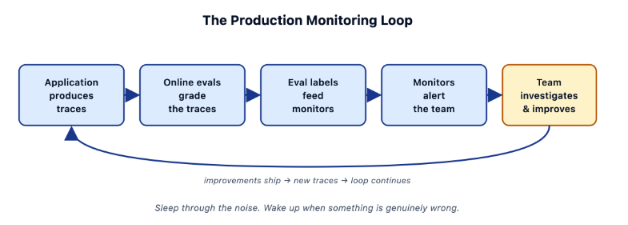

# Lecture 12: Monitors and Alerts

> **Learning objective:** Configure monitors that watch production metrics continuously, set thresholds and alert destinations correctly, understand why sustained trends matter more than individual failures, and see how this closes into a CI/CD process for evals.

---

## 1. What Is a Monitor?

A **monitor** is continuous surveillance of a metric — it watches a value over time and alerts you the moment it crosses a threshold. A monitor can watch essentially anything tracked in your project: latency, token usage, cost, or — most relevant to everything built in Lectures 6–11 — an **eval label**.

This is the natural extension of Lecture 11's online evals: an online eval produces a continuous stream of labels on live traffic; a monitor is what actually watches that stream and tells you when it's worth paying attention to.

---

## 2. Create a Monitor in Arize AX

The setup steps below follow Arize AX's actual monitor workflow:

1. Go to **Monitors** in the left sidebar and click **+ New Monitor**.
2. Select a **Tracing Project Monitor**.
3. Choose between a **Managed Monitor** (Arize configures it automatically — good for getting started quickly) or a **Custom Monitor** (you set every field yourself — recommended once you know exactly what you want to track, since it avoids the noise that broad managed monitors can produce).
4. For a custom monitor, define the data to watch: the **metric source** (a span attribute, a custom metric, and so on) and the specific **attribute** or field.
5. Set the **threshold type** — automatic or static (Section 4).
6. Set the **evaluation window** — how often the monitor checks (hourly, daily, weekly), or **Manual/API-triggered** if you'd rather fire it programmatically after a specific event like a batch ingestion job.
7. Assign an **alert destination** (Section 6) so the monitor actually notifies someone when it fires.

One additional setting worth knowing: a **delay window** gives your data time to fully arrive before the monitor evaluates it — useful if your traces land in batches and an early, incomplete read would otherwise trigger a false alert.

---

## 3. Configure a Monitor on an Eval Label

Here's what that configuration looks like for a monitor watching Lecture 7's actionability judge specifically:

| Setting | Example value | What it controls |
|---|---|---|
| **Project** | `ax-financial-demo` | Which traced application this monitor watches |
| **Metric source** | Span attribute | Where the value being watched comes from |
| **Attribute** | `eval.actionability.label = "not actionable"` | The exact signal being tracked — the online eval's own output label |
| **Window** | 24 hours | The span of data considered in each check |
| **Frequency** | Hourly | How often the monitor re-evaluates that window |

Notice the attribute being watched, `eval.actionability.label`, is exactly the naming pattern from Lecture 6 and 7's own logged results (`eval.{eval_name}.label`) — a monitor doesn't need new infrastructure, it just watches the data your evals were already producing.

---

## 4. Automatic vs. Static Thresholds

Two ways to decide when a monitor should actually fire:

- **Automatic** — Arize AX sets the threshold based on your own historical baseline, and you can tune its sensitivity (higher sensitivity means more alerts, lower means fewer).
- **Static** — you specify an exact number yourself (for example, "alert if the actionability pass rate drops below 85%").

**Pick automatic when you're unsure** what a reasonable threshold even is yet — it adapts to what your system's normal behavior actually looks like instead of asking you to guess a number up front. Static thresholds work well once you have a specific, known requirement (a guardrail from Lecture 8, for instance) rather than a general sense of "alert me if this looks off."

---

## 5. Alert on Sustained Drops, Not Individual Failures

A single failing trace is expected — no eval, however well validated (Lecture 9), will show a 100% pass rate forever. **Treating every individual failure as alert-worthy is just noise**, and noisy alerting trains people to ignore the alerts entirely.

**A trend moving in the wrong direction over time is signal.** A monitor's window and frequency settings (Section 2–3) exist specifically to support this distinction — a 24-hour window checked hourly can show a sustained decline over the day, rather than firing every time one report happens to fail.

---

## 6. Alert Destinations

Once a monitor fires, it needs somewhere to actually send that alert:

- **Slack**
- **PagerDuty**
- **Email**
- **Webhooks** (for anything else — a custom backend, a ticketing system, your own Slack bot)

**Setting up a destination:**

1. Go to **Alert Integrations** — found in Organization Settings, or via the **Config** tab within a specific project.
2. Choose the integration: for **PagerDuty**, either connect directly (log in, select services) or manually enter an API integration key; for a **Webhook**, provide a name, an HTTPS URL, and an optional authorization header, then choose which events to subscribe to (`monitor.triggered`, `monitor.cleared`, `monitor.no_data`).
3. Once registered, assign that integration to specific monitors — either broadly at the project level, or individually per monitor if you want different monitors routing to different places.

---

## 7. Guardrails vs. North-Stars, Again

Lecture 8 drew this distinction for evals in general; it applies directly to how you route alerts:

- **Guardrails** → page someone. Route these to **PagerDuty** — a ship-blocking failure deserves an interruption, not a message someone reads next week.
- **North-stars** → notify **Slack**, reviewed weekly. An aspirational metric drifting slightly doesn't need to wake anyone up; it needs to be visible when the team next looks at trends.

Getting this wrong in either direction repeats Lecture 8's warning: paging someone for a north-star metric trains people to ignore pages; posting a guardrail breach to a Slack channel nobody's watching lets a real regression sit unnoticed.

---

## 8. The Full Loop

This is the entire system from Lectures 3–12 running end to end, continuously, with no manual step in the middle:

1. **The application produces traces** — Lecture 3–4's instrumentation.
2. **Online evals grade the traces** — Lecture 11, running the same evaluators built in Lectures 6–7 against sampled live traffic.
3. **Eval labels feed monitors** — Section 3 above, watching those labels over time.
4. **Monitors alert the team** — Sections 5–7, routed appropriately by guardrail or north-star.
5. **The team investigates and improves** — Lecture 5's reading practice, Lecture 10's grounded fixes and experiments.

And then, critically, the loop doesn't end there: **improvements ship → new traces get produced → the loop continues**, feeding the newly-fixed behavior straight back into step 1.

The quieter, equally important idea underneath the diagram: **sleep through the noise, wake up when something is genuinely wrong.** That's the entire purpose of Sections 4–5 — a well-tuned monitor is what makes it possible to trust that silence means things are fine, instead of needing to manually check a dashboard to find out.

---

## 9. What This Gives You

Put together, Lectures 1 through 12 add up to a specific capability: a change to a prompt, an agent, or a model doesn't just get tested once before shipping — it gets watched continuously afterward, and any regression gets caught and routed to the right place automatically, without anyone needing to remember to go check.

---

## 10. CI/CD for Evals

The final extension of this idea: run the same eval suite not just continuously on production traffic (Lecture 11), but **on every prompt or code change**, before it ever reaches production.

- **Block the merge if guardrails regress** — this is Lecture 1's CI quality gate and Lecture 8's guardrail-as-gate principle, now made concrete: a pull request that regresses a guardrail eval simply doesn't merge.
- **The same evals now run in two places** — once in CI, against a change before it ships, and once online (Lecture 11), against real traffic after it ships. Nothing about the evaluator itself changes between the two; only *when* and *against what* it runs.

This is the complete picture the whole course has been building toward: the same rubric, validated once (Lecture 9), reused everywhere — offline in development, in CI before every merge, and online against every real user interaction — so that "did this change make things better or worse" is never a question answered by vibes, at any stage of the system's life.

---

## Key Takeaways

1. **A monitor is continuous surveillance of a metric**, built to alert when a threshold is crossed — and it can watch anything, including the eval labels from Lectures 6–7.
2. **Setting one up means choosing a metric source, a threshold type, an evaluation window, and an alert destination** — each with a specific role.
3. **Automatic thresholds adapt to your own historical baseline; static thresholds enforce a specific number you already know matters.**
4. **Individual failures are noise; a sustained trend is signal** — window and frequency settings exist specifically to separate the two.
5. **Alert destinations should match the eval's role**: guardrails page someone (PagerDuty); north-stars get reviewed on a cadence (Slack).
6. **The full production loop is self-sustaining**: traces → online evals → monitors → alerts → fixes → new traces, with no manual handoff required in the middle.
7. **The end state is the same evals running in two places** — CI before a change ships, and online after — turning "is this actually better" into a question with a real, continuously-available answer.

---

## Check Your Understanding

1. What's the difference between what an online eval does and what a monitor does?
2. Walk through the steps to create a custom monitor watching an eval label in Arize AX.
3. When would you choose an automatic threshold over a static one?
4. Why is alerting on every individual failure counterproductive?
5. Which alert destination fits a guardrail, and which fits a north-star — and why does that pairing matter?
6. In the full production loop, what happens after "the team investigates and improves" — and why does that matter for the loop as a whole?
7. What does "the same evals now run in two places" actually mean, and what stays constant between those two places?

---

## Summary

A monitor turns the continuous grading from Lecture 11's online evals into something that actually reaches a person at the right moment — watching eval labels the same way it watches latency or cost, distinguishing a sustained regression from ordinary noise, and routing the two very different failure types from Lecture 8 (guardrails and north-stars) to destinations that match their urgency. Extended into CI, the same evaluators that watch production also gate every change before it ships, closing the course's central loop: the same validated rubric, applied consistently from a pull request all the way through to live user traffic, so that whether something got better or worse is always a measured answer — never a guess.
