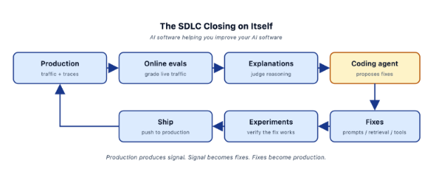

# Lecture 13: From Explanations to Fixes — Feeding Evals into Coding Agents

> **Learning objective:** Turn patterns in eval explanations into concrete prompt fixes by handing them to a coding agent, verify those fixes the same way any other change gets verified, and see how the whole course closes into one self-improving loop.

---

## 1. Quick Recap on Explanations

Every LLM judge built in this course — Lecture 7's Faithfulness and Actionability evaluators, the custom rubrics from Lecture 9 — produces two things, not one: a **label** (pass/fail, actionable/not actionable) and an **explanation** describing *why*. Something like: *"The response fails to include a budget breakdown..."*

Everything in this lecture starts from that explanation field, not the label.

---

## 2. One Explanation Is Interesting

A single explanation on a single failing trace tells you about that one case. It's useful — it's exactly what Lecture 5 and 7 already relied on for reading individual failures closely — but on its own, it doesn't tell you whether you're looking at a one-off or something systemic.

---

## 3. A Pattern of Explanations Is Signal

Read a dozen or more failure explanations (Lecture 5's original reading practice) and something different emerges: the same underlying issue phrased slightly differently, over and over. That repetition — not any single explanation — is what tells you there's a real, fixable pattern rather than isolated noise. This is Lecture 5's open/axial coding, just applied specifically to a judge's own explanations instead of raw traces.

---

## 4. This Is Hard to Do by Hand

Spotting a theme across a handful of explanations is manageable. Spotting it across hundreds — the scale online evals (Lecture 11) actually produce — isn't something a person can realistically do by re-reading every explanation line by line. This is exactly the kind of pattern-recognition-at-scale problem an LLM is well suited to, which is where this lecture's actual workflow comes in.

---

## 5. The New Pattern

1. **Export failing traces and their explanations** from Arize AX — the same failure-dataset mechanism from Lecture 10.
2. **Hand them to a coding agent** (Claude Code, Cursor, or similar) as context.
3. **Ask it directly:** *"Find the patterns. Propose prompt changes."*
4. **Re-run evals to verify** the proposed change actually helps (Section 10).

This is Lecture 10 Section 5's "let an LLM rewrite the prompt" idea, made concrete: instead of one ad hoc API call, it's a full coding-agent workflow working from real exported evidence, with the same experiment-based verification from Lecture 10 closing the loop at the end.

---

## 6. Why This Works

A coding agent is a good fit for this specific job for a few concrete reasons: it can read far more explanations at once than a person reasonably would, it's already built to propose and reason about code/prompt changes rather than just describe problems, and — critically — it's working from the same grounded evidence (Lecture 5 and 7's explanations) that Lecture 10 already established as the right input for any legitimate fix. It doesn't replace the judgment of *what counts as a real pattern*; it makes it practical to find that pattern at a scale a human reading traces one at a time can't keep up with.

---

## 7. Feed the Requirements Too

There's a real trap here: an eval explanation describes *what failed the eval*, not necessarily *what the business actually needs*. **"Make the evals pass" is not the same goal as "meet the requirement."** A coding agent optimizing purely against explanation text could plausibly patch the prompt in a way that satisfies the letter of the rubric without actually producing what the eval was written to protect in the first place — recall Lecture 7's actionability rubric existed because *someone* decided what "actionable" should mean; that intent lives in the requirement, not just in the failure text.

**Hand the coding agent your actual requirements alongside the explanations** — not just "here's what failed," but "here's what a financial report is actually supposed to accomplish for the user." Both inputs matter; neither one alone is enough.

---

## 8. Don't Chase Individual Failures

Not every flagged failure is real. Lecture 8 and 9 already covered this: a judge can produce false positives, and an unvalidated or poorly calibrated eval can flag something that isn't actually wrong. **Chasing a single failure risks chasing eval noise instead of a real system problem.**

**Themes across many failures are the actual signal.** Tell the coding agent explicitly to find patterns, not to treat each individual explanation as its own required fix — the same instinct behind Lecture 12's "alert on sustained drops, not individual failures," now applied to fixing instead of alerting.

---

## 9. Walking Through an Example

Take the actionability evaluator from Lecture 7. Suppose a batch of exported failures shows a recurring shape in their explanations: report after report gets marked "not actionable" for the same underlying reason — each one summarizes the researched data (revenue growth, margins, valuation) without ever turning it into a recommendation or naming a specific risk.

That's a pattern, not a one-off (Section 3). Exported alongside the actual actionability rubric (Section 7's "requirement," not just the failure text), a coding agent has what it needs to look at the two-turn prompt from Lecture 4 — specifically the `WRITE_PROMPT` and the write-phase instructions — and propose a change that makes "include a specific recommendation and a supporting risk" an explicit requirement, rather than something left implicit and, apparently, frequently skipped.

---

## 10. What the Coding Agent Produces

The practical output of a workflow like this is usually a concrete, reviewable change: a proposed diff to the prompt or instruction text, along with the agent's own reasoning for *why* — ideally referencing which explanation pattern motivated which specific wording change. That traceability matters: it's what lets a human reviewer confirm the fix is actually addressing Section 3's real pattern, not just plausible-sounding rewording.

---

## 11. Verify Before Shipping

A coding agent's proposed fix is a hypothesis, not a conclusion — the same standard Lecture 10 already set for any prompt change. Before it ships, it runs through the exact same experiment pattern from Lecture 10, Section 7: the same failure dataset, the same actionability evaluator, only the prompt version as the variable. If the revised prompt scores meaningfully better on the same cases that were failing before — **no vibes, just numbers** (Lecture 10, Section 10) — it's ready to ship. If it doesn't, that's useful information too, and the cycle (Lecture 10, Section 11) repeats.

---

## 12. What We Built

Zoomed all the way out, the thirteen lectures in this course form one connected pipeline:

| Stage | What it means | Where it was built |
|---|---|---|
| **Instrument** | Wire up tracing so the system's behavior is observable at all | Lecture 3 |
| **Trace** | Build the actual traced agent, generating real spans to work from | Lecture 2 (concept), Lecture 4 (build) |
| **Eval** | Grade that behavior — structurally and semantically | Lectures 6–7 |
| **Calibrate** | Verify the judge itself is trustworthy before relying on it | Lecture 9 |
| **Iterate** | Turn findings into grounded fixes, tested as controlled experiments | Lecture 10 |
| **Ship** | Gate deployment on guardrail evals, not impressions | Lecture 1, Lecture 12 (CI/CD) |
| **Monitor** | Watch live traffic continuously, alert appropriately | Lectures 11–12 |
| **Close the loop** | Turn production failures back into fixes, automatically assisted | Lecture 13 (this one) |

Each stage depends on the ones before it holding up — calibration (Lecture 9) is meaningless without evals to calibrate (Lecture 6–7); monitoring (Lecture 11–12) is meaningless without evals worth watching continuously. This lecture is the stage that turns the end of that chain back into its beginning.

---

## 13. Start Small

None of this needs to be built all at once. The natural on-ramp, consistent with Lecture 8's "one evaluator per dimension": pick a single guardrail, get one eval validated (Lecture 9), wire up one monitor (Lecture 12), and only then expand to the next dimension. Trying to stand up the full instrument→monitor→close-the-loop pipeline in one pass is a much easier way to end up with Lecture 8's eval debt than with a working system.

---

## 14. Evals Are Infrastructure

The closing idea of the course: **evals aren't a one-time setup task — they're a core, ongoing part of the system**, the same category of investment as CI/CD, logging, or monitoring itself. Lecture 8 already showed what happens when that investment lapses (eval debt, quietly compounding into wrong decisions). The inverse is just as true in the other direction: **the value compounds, but only if you keep investing** — revalidating judges as the system changes, expanding coverage to new dimensions, feeding new production failures back into datasets and, now, into coding-agent-assisted fixes.

---

## 15. The SDLC Closing on Itself

This is the entire course as one loop, with AI software now helping improve the AI software that produces it: production traffic and traces feed **online evals**, which grade live traffic and produce **explanations** — the judge's reasoning, not just its labels. A **coding agent** reads those explanations and proposes **fixes** to prompts, retrieval, or tools. Those fixes get verified as **experiments** before anything ships, and shipping produces new production traffic — starting the loop over again.

**Production produces signal. Signal becomes fixes. Fixes become production.**

---

## Key Takeaways

1. **An eval's explanation field is more valuable in aggregate than any single instance** — one explanation is a data point; a pattern across many is a finding.
2. **Coding agents are well suited to finding patterns at a scale manual reading can't match**, but they still need to be pointed at real, exported evidence.
3. **Requirements and explanations are both necessary inputs** — explanations describe what failed the eval; requirements describe what the eval was written to protect in the first place.
4. **Chase themes, not individual failures** — a single flagged case can be eval noise; a repeated pattern is signal worth acting on.
5. **A coding agent's proposed fix is a hypothesis that still needs Lecture 10's experiment verification** before it ships — nothing about that standard changes just because the fix was AI-assisted.
6. **The whole course is one connected pipeline** — instrument, trace, eval, calibrate, iterate, ship, monitor, close the loop — where each stage depends on the ones before it actually holding up.
7. **Start with one dimension, not the whole system at once**, and treat evals as permanent infrastructure whose value compounds only with continued investment.

---

## Check Your Understanding

1. Why does a single failing trace's explanation matter less than a pattern across many?
2. What specifically makes this kind of pattern-finding hard to do by hand at production scale?
3. Why isn't "the coding agent's fix made the evals pass" sufficient justification to ship it?
4. Why should a coding agent be told to look for patterns instead of fixing every flagged failure individually?
5. What verification step does an AI-proposed prompt fix go through before shipping, and why does that matter?
6. Walking through the "What We Built" table, which stage would fail first if Lecture 9's calibration step were skipped entirely?
7. What does "evals are infrastructure" mean in practice, and what happens if that investment isn't sustained?

---

## Summary

This course opened with a simple problem: shipping AI by vibes doesn't scale, and there's no way to know if a change actually helped without evals. Thirteen lectures later, that problem is fully closed: traces make behavior observable, evals make it measurable, calibration makes the evals themselves trustworthy, experiments turn fixes into evidence instead of guesses, and monitors keep watching after deployment. This final piece — feeding real eval explanations and requirements into a coding agent — is what turns that whole pipeline into something that improves itself: production produces signal, signal becomes fixes, and fixes become the next round of production. The system doesn't just get evaluated anymore. It gets better, continuously, because the loop closes back on itself.
