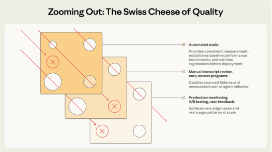

# Lecture 5: Read Your Data Before You Write Evals

> **Learning objective:** Understand why reading raw traces has to come before writing evals, how to turn what you read into explicit, actionable success criteria, and why no single quality check — automated or human — is enough on its own.

---

## 1. Why This Matters

It's tempting to jump straight from "we have tracing set up" (Lecture 3–4) to "let's write some evals" (Lecture 1–2). Skipping a step in between causes problems: **you have to read your data before you can grade it.**

In practice, that means:

- Read your traces **end to end** — the full input, the full reasoning/tool-call path, the full output — not just a summary.
- Read **a dozen or more** — a single trace tells you almost nothing about what's typical.
- Pay particular attention to the traces where **something went wrong**. For each one, ask:
  - What was the input?
  - What was the output?
  - What, specifically, is broken?

That last question — *specifically* — is the important one. "It didn't work" isn't a finding yet; it's a starting point.

---

## 2. Why We Read First: You Need Success Criteria

You can't evaluate a system against a standard you haven't defined. Saying **"it doesn't work"** is only meaningful once you can say what "works" means for this specific system, and that definition doesn't come from intuition — it comes from actually reading how the system behaves.

This has a direct consequence: **defining success is cross-functional work**, not something an engineer does alone at their desk. A financial report agent's idea of "good" involves accuracy (engineering), tone and readability (content/product), and what claims are acceptable to state as fact versus outlook (domain expertise, compliance). Reading real traces together, across those roles, is what turns "it should be good" into a written, explicit set of success criteria you can actually build an eval against.

---

## 3. Where to Get Test Data

The data you read (and later evaluate against) depends on where you are in the lifecycle:

| Stage | Data source |
|---|---|
| **Before production** | Synthetic data — hand-written or generated test cases covering the scenarios you expect |
| **After production** | Real user queries pulled from traces — actual behavior, not assumptions about behavior |

**Diversity is critical** in both cases. A test set that only covers the "happy path" — the easy, expected cases — will pass every eval you write against it while missing exactly the situations most likely to break in production. Deliberately **don't forget the edge cases**: unusual phrasing, missing information, requests at the boundary of what the system is supposed to handle.

---

## 4. Examining Real Traces: When the Data Looks Right but Isn't

Reading traces isn't just about finding obvious failures — some of the most important reading happens when a response *looks* fine on the surface but isn't.

This is the **"confidently wrong" problem** introduced in Lecture 2: a fluent, well-structured, plausible-sounding output that is nonetheless incorrect. It's exactly the kind of failure that's easy to miss with a quick skim and easy to miss with a narrow, rigid eval — which is precisely why reading full traces closely, before you've decided what to check for, matters so much.

---

## 5. Open vs. Axial Coding

To read a stack of traces without just guessing at patterns, borrow a method from qualitative research (this is genuinely qualitative work, not engineering, even though the output feeds into engineering decisions):

- **Open coding** — read each trace and name what you see, without a preconceived list of categories. If a response fabricates a number, note that. If it misunderstands the request's scope, note that. At this stage you're not organizing yet, just observing and labeling honestly.
- **Axial coding** — once you have a pile of open-coded notes, group them. Which labels keep showing up? Which ones are really the same underlying issue described differently? This is where the bigger themes emerge.

The point of doing it in this order is to avoid forcing your data into categories you already believed in before you looked. The categories should come *from* the traces, not get imposed *onto* them.

---

## 6. Categorize by Root Cause

Axial coding should get you to categories that are specific enough to act on. **"The response was wrong" is not actionable** — it doesn't tell you what to change. Root-cause categories do:

| Root cause | What it means | What you'd fix |
|---|---|---|
| **Retrieval failure** | The system found the wrong or insufficient information | Improve search/retrieval |
| **Reasoning error** | The information was right, but the logic applied to it wasn't | Improve prompts/reasoning steps |
| **Hallucination** | The system stated something not supported by its sources | Add grounding checks |
| **Scope violation** | The system did something outside what it should handle | Add explicit boundaries |

Each of these points to a different fix. That's the real payoff of reading before writing evals — you don't just end up with "the agent failed 20% of the time," you end up with "12% of failures were hallucinations and 8% were retrieval failures," which tells you where to actually spend engineering effort.

---

## 7. Prioritize: Frequency × Severity

Not every category deserves equal attention. Once you've root-caused your failures, prioritize fixing them using two dimensions together:

- **Frequency** — how often does this happen?
- **Severity** — how bad is it when it does?

A rare-but-catastrophic failure (say, a hallucinated figure in a financial report) and a common-but-minor one (slightly awkward phrasing) both show up in your data, but they don't deserve the same response. Weighing frequency **and** severity together — rather than fixing whatever's most common, or whatever's scariest, in isolation — is what keeps this process pointed at what actually matters for the system in production.

---

## 8. Zooming Out: The Swiss Cheese Model of Quality

This is a classic model from safety engineering: picture each layer of your quality process as a slice of Swiss cheese — full of holes, because no single check is perfect. A failure that slips through the hole in one layer gets caught if the next layer's holes happen to be in a different place. It's only a problem when holes in *every* layer line up at once and a failure passes straight through undetected.

Mapped onto AI quality, the layers are:

- **Automated evals** — provide consistent, repeatable measurement; establish baseline performance benchmarks; catch regressions before deployment. (This is Lecture 1 and 2's territory — code evals and LLM-as-a-judge evals.)
- **Manual transcript review, early access programs** — catches nuanced failures and unexpected user or agent behavior that a fixed rubric wouldn't think to check for. (This is this lecture — open/axial coding on real traces.)
- **Production monitoring, A/B testing, user feedback** — surfaces rare edge cases and real usage patterns at scale that no pre-launch test set could fully anticipate. (This connects back to Lecture 1's ship → monitor → iterate loop.)

The takeaway isn't "pick the best layer." It's that **no single layer is sufficient on its own** — automated evals are fast and consistent but only catch what they were written to check for; manual review is nuanced but doesn't scale; production monitoring sees everything but only after it's already reached real users. Quality comes from stacking these layers so that what slips past one is likely to be caught by another — which is exactly why this lecture's practice of reading raw traces closely isn't a step you skip once you have automated evals in place. It's a different layer, catching a different kind of failure.

---

## Key Takeaways

1. **Read before you grade.** You can't write a meaningful eval for a standard you haven't observed and defined.
2. **"It doesn't work" isn't a finding** — success criteria have to be explicit, and defining them is cross-functional, not just engineering.
3. **Test data source depends on your stage**: synthetic before production, real traces after — and diversity, including edge cases, is non-negotiable either way.
4. **The most dangerous failures often look fine on the surface** — the "confidently wrong" problem is why close reading matters more than a quick skim.
5. **Open coding first, axial coding second** — let categories emerge from the data instead of forcing traces into assumptions you started with.
6. **Root-cause categories are what make findings actionable** — "wrong" isn't a fix; "retrieval failure" or "hallucination" is.
7. **Prioritize by frequency × severity together**, not by whichever dimension is more visible in the moment.
8. **No single quality layer is enough on its own** — automated evals, manual review, and production monitoring each catch what the others miss.

---

## Check Your Understanding

Before moving to Lecture 6, you should be able to answer:

1. Why does reading traces have to come before writing evals, not after?
2. Why is "it doesn't work" not yet a usable finding?
3. Where should your test data come from before you're in production, and where should it come from afterward?
4. What is the "confidently wrong" problem, and why is it easy to miss?
5. What's the difference between open coding and axial coding, and why does the order matter?
6. Why is "the response was wrong" not an actionable category, and what are four categories that would be?
7. Why do you need both frequency and severity to prioritize fixes, not just one?
8. In the Swiss Cheese model, what does each of the three layers catch that the others might miss?

---

## Summary

Writing good evals depends on knowing what you're actually checking for — and that knowledge only comes from closely reading real system behavior first. Open and axial coding turn a stack of traces into concrete, root-caused categories of failure; frequency and severity together tell you which of those categories to fix first. Zoomed all the way out, this reading process is just one layer in a larger quality system — automated evals, manual review, and production monitoring each have blind spots, and it's the combination of all three, not any one of them alone, that keeps failures from reaching users undetected.
